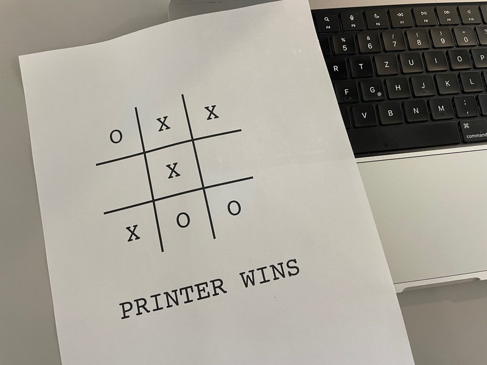

# PSTicTacToe

### Play Tic-Tac-Toe Against your Printer

Send `ttt.ps` to your printer:

    cat ttt.ps - | nc 192.168.2.10 9100
    
Or use Ghostscript:

    gs ttt.ps

Play by entering numbers from 1 to 9.

The code will produce console + print output.

### Files

Both files are equivalent.

`ttt_full.ps` is the readable version.

`ttt.ps` is the minified version.

### Algorithm

Printer applies the following rules.

Dead simple and keeps the fun.

1. printer attempts to block human
2. printer attempts to win
3. printer plays randomly

### Sample Output

    OX.
    .X.
    XO.
    
    human turn (1-9) >9
    
    OX.
    .X.
    XOO
    
    
    OXX
    .X.
    XOO
    
    PRINTER WINS

